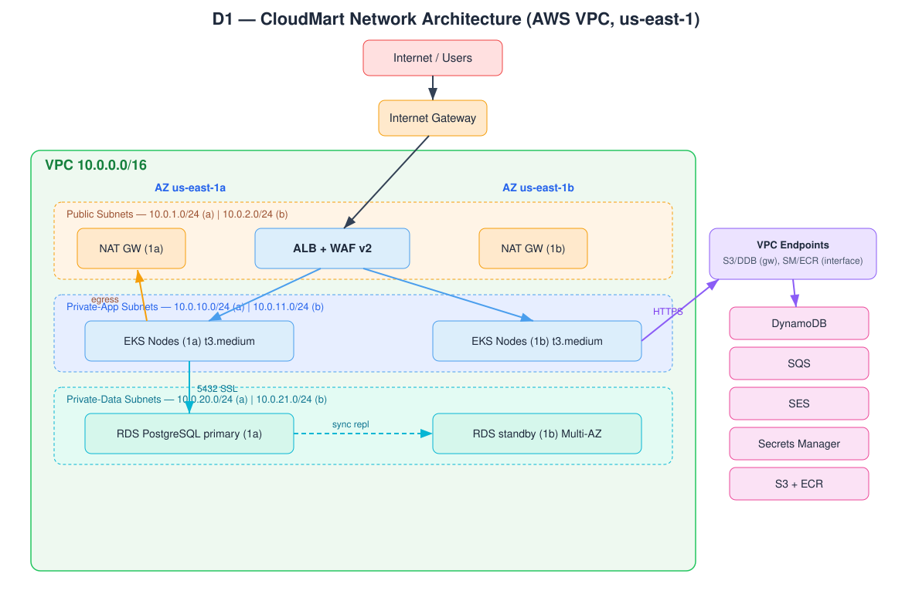
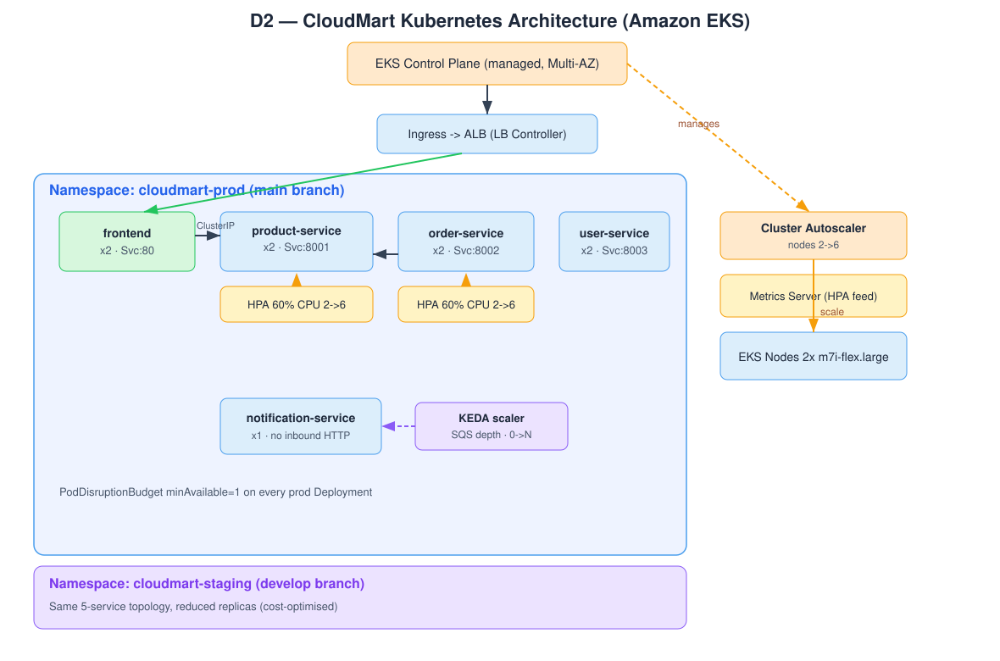
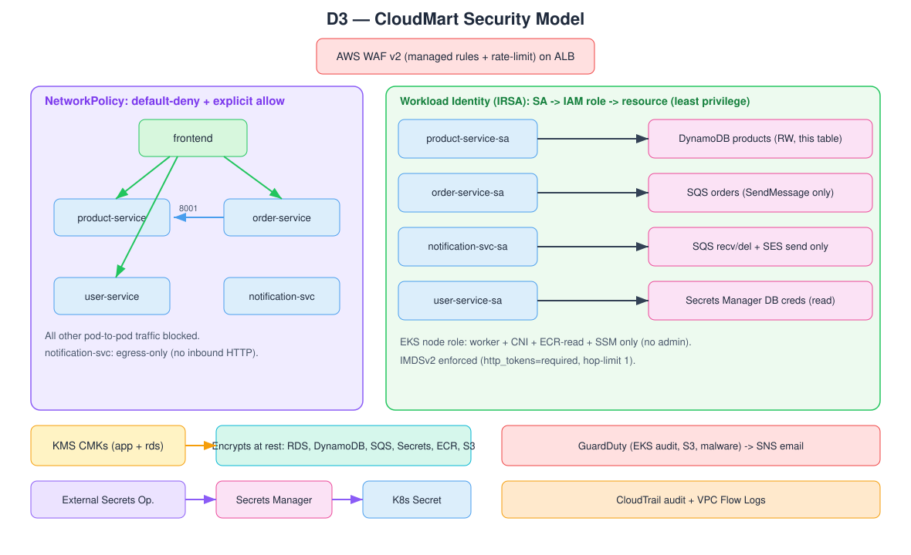
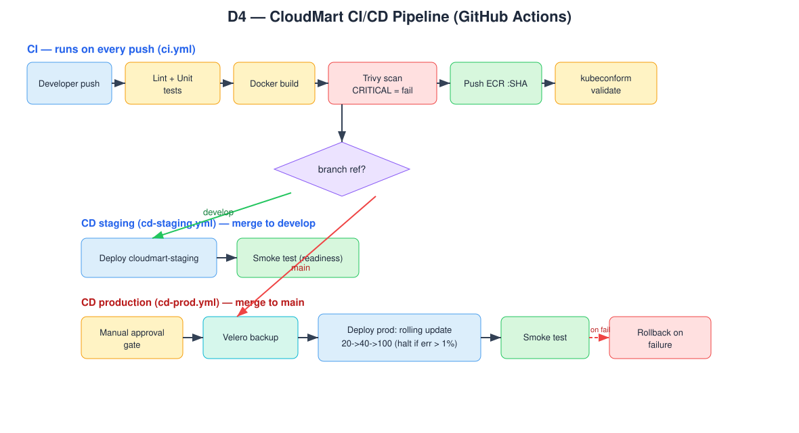
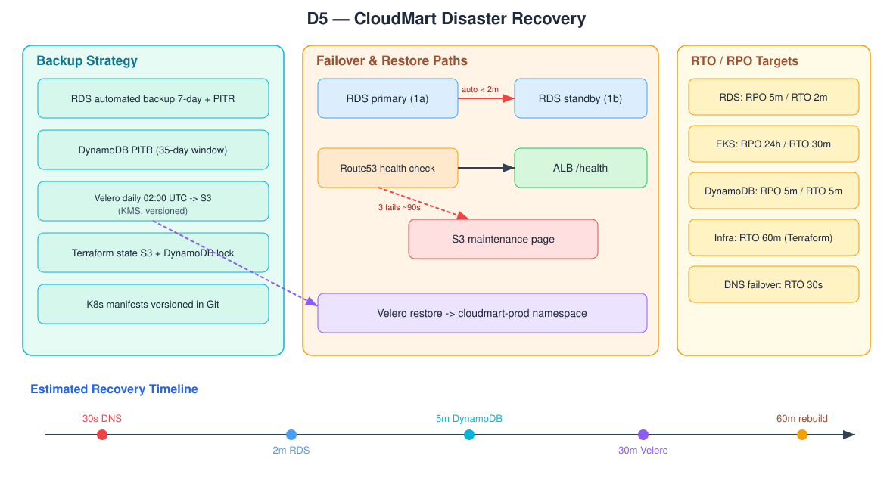

# CloudMart: Production-Grade Microservices Platform on Amazon EKS
### IS 4630 — Cloud Infrastructure Design, Deployment & Security Project

**Team:** group-01
**Cloud Provider:** Amazon Web Services (AWS)
**Region:** us-east-1 (parameterised — nothing hardcoded)
**Repository:** `/infra`, `/k8s`, `/services`, `/docs`, `.github/workflows`

| Member | Role | Primary Contributions |
|--------|------|-----------------------|
| Madhura Jayashanka | Platform / DevOps | Environment roots, CI/CD pipelines, monitoring & alarms, budgets, Velero/DR, cost & DR docs |
| Dilshan Prasanna Allepola | Core Infrastructure | VPC networking and managed-data modules (RDS, DynamoDB, SQS, S3, KMS, Route 53) |
| Asela Maduwantha | Kubernetes & Delivery | K8s base manifests, NetworkPolicies, Kustomize overlays, External Secrets, Kyverno, EKS/ECR |
| Akhila Sanjeewa | Application & Helm | Microservice source (product/order/user/notification), Helm charts and values files |
| Himasha Kodikara | Security & Frontend | IAM/IRSA workload identity, secrets integration, frontend SPA and cross-service wiring |

> **Note on screenshots.** Sections 5, 3 and 6 reference live-console evidence (cost dashboard, GuardDuty finding, backup/restore). These are produced after `./deploy.sh -e <env>` runs against a real AWS account and are captured during the live demo. Capture points are marked **[SCREENSHOT]** with the exact console path / CLI command to reproduce them.

---

## 1. Executive Summary

CloudMart has been re-platformed from a single-VM monolith into **five containerised microservices** running on **Amazon EKS** across two Availability Zones. The entire stack — network, cluster, managed data services, identity, security controls, observability, and CI/CD — is defined as code (Terraform + Kubernetes manifests/Helm) and deployed automatically from Git.

**Why AWS.** AWS was selected for the maturity of EKS, first-class **IRSA** workload identity (per-pod IAM with no node-level credentials), and the breadth of managed backends each service requires (RDS, DynamoDB, SQS, SES, Secrets Manager, KMS). The generic services in the brief map cleanly to AWS equivalents (Appendix A).

**Key architectural decisions.**
- **Three-tier VPC** (`10.0.0.0/16`) across 2 AZs: public, private-app, private-data — databases have *no* route to the internet.
- **Per-service least-privilege IAM via IRSA** — each pod assumes only the permissions its job requires (e.g. product-service can only read/write its DynamoDB table).
- **Defence in depth** — WAF on the ALB, default-deny NetworkPolicies, Kyverno admission control, KMS encryption at rest, TLS in transit, GuardDuty threat detection.
- **Automated delivery** — GitHub Actions CI (test → Trivy scan → build → push → manifest validation) and CD with a manual approval gate, pre-deploy Velero backup, health-gated rolling updates, smoke tests and automatic rollback.

**Outcome metrics.**
- **Cost:** ~**\$401/month** production, ~**\$253/month** staging on-demand; **\$40.10 per 1,000 orders** unit economics; a 1-year Reserved Instance plan saves **\$621/yr (37%)** on compute.
- **Availability:** 2+ replicas per production service, HPA + Cluster Autoscaler, RDS Multi-AZ, PodDisruptionBudgets.
- **Security posture:** least-privilege IAM, no public database, encrypted everywhere, automated vulnerability gates, admission policy enforcement.
- **Recovery:** RDS **RPO ≤ 5 min / RTO ≤ 2 min**; full-stack rebuild ≤ 60 min via IaC + Velero.

---

## 2. System Architecture

### 2.1 Network (Diagram D1)



A single `/16` VPC spans two AZs (`us-east-1a`, `us-east-1b`) with a strict three-tier subnet design:

| Tier | AZ-a CIDR | AZ-b CIDR | Contains | Internet route |
|------|-----------|-----------|----------|----------------|
| Public | `10.0.1.0/24` | `10.0.2.0/24` | ALB, NAT GW | IGW (in + out) |
| Private-App | `10.0.10.0/24` | `10.0.11.0/24` | EKS worker nodes | NAT GW (out only) |
| Private-Data | `10.0.20.0/24` | `10.0.21.0/24` | RDS PostgreSQL | none (no egress) |

- **Internet Gateway** for public subnets; **one NAT Gateway per AZ** in production (HA), single NAT in staging (cost saving) — controlled by the `single_nat_gateway` variable.
- **Per-tier route tables**: public → IGW; private-app → NAT; private-data → local only.
- **VPC endpoints** keep AWS-API traffic off the public internet and off the NAT data path: S3 + DynamoDB **gateway** endpoints, Secrets Manager + ECR (api/dkr) **interface** endpoints.
- **VPC Flow Logs** stream to CloudWatch with saved Logs Insights queries (top rejected traffic, top talkers).

Security groups follow least privilege: the ALB SG accepts 80/443 from the internet; the node SG accepts traffic only from the ALB SG and itself; the RDS SG accepts **5432 only from the node SG**; the bastion SG opens SSH only to explicit admin CIDRs (and fails closed to SSM Session Manager when none are set).

### 2.2 Kubernetes (Diagram D2)



All five services run as Deployments in namespace **`cloudmart-prod`** (and **`cloudmart-staging`** for the develop branch):

| Service | Replicas (prod) | Service type | Autoscaling |
|---------|-----------------|--------------|-------------|
| frontend (React/Nginx) | 2 | ClusterIP :80 (via Ingress/ALB) | — |
| product-service (Flask) | 2 | ClusterIP :8001 | **HPA 60% CPU 2→6** |
| order-service (Express) | 2 | ClusterIP :8002 | **HPA 60% CPU 2→6** |
| user-service (Flask) | 2 | ClusterIP :8003 | — |
| notification-service (Node) | 1 | no Service (consumer) | **KEDA on SQS depth** |

Every container declares **resource requests/limits**, **liveness + readiness probes**, a **rolling strategy `maxSurge:1 / maxUnavailable:0`**, a non-root `securityContext` (`readOnlyRootFilesystem`, dropped capabilities), and a **PodDisruptionBudget (minAvailable:1)**. The **Cluster Autoscaler** adds nodes (2→6) when pods cannot schedule; the **Metrics Server** feeds the HPAs. The **Ingress** uses the AWS Load Balancer Controller with ALB annotations (TLS 1.3 policy, WAF ACL attachment, `/health` health check).

**Technology choices justified:** EKS managed node group on `m7i-flex.large` (ADR-001); RDS PostgreSQL for relational user data (ADR-002); health-gated rolling update for product-service (ADR-003).

---

## 3. Security Design (Diagram D3)



### 3.1 Threat model (STRIDE summary)

| Threat | Vector | Control |
|--------|--------|---------|
| Spoofing | Stolen pod credentials | IRSA — short-lived, per-SA tokens; no static keys |
| Tampering | Malicious image | Trivy CRITICAL gate + Kyverno "ECR-only" pull policy |
| Repudiation | Untracked actions | CloudTrail (multi-region, log-file validation) |
| Information disclosure | DB exposure | Private-data subnet, no internet route; KMS at rest; TLS in transit |
| Denial of service | L7 flood | WAF rate-limit (2,000 req/5 min/IP) + AWS Shield Standard |
| Elevation of privilege | Container breakout | Non-root, `readOnlyRootFilesystem`, drop ALL caps, Kyverno block-root/privileged |

### 3.2 Network policy justification

A **default-deny** NetworkPolicy covers the namespace; explicit allow rules implement exactly the brief's communication matrix:
- `frontend → product, order, user` (ports 8001/8002/8003)
- `order → product` (8001) and egress to SQS (443)
- `user → RDS` (5432) and Secrets Manager (443)
- `product → DynamoDB` (443 via endpoint)
- `notification`: **egress-only** (SQS poll + SES send), no inbound HTTP
- a dedicated allow-DNS policy permits port 53 to kube-dns.

### 3.3 Workload identity design

Each service has its own Kubernetes ServiceAccount bound to a dedicated IAM role (IRSA), scoped to a single resource and action set:

| Service | IAM permission (only) |
|---------|-----------------------|
| product-service | DynamoDB `GetItem/PutItem/Query/Scan…` on the products table + its indexes |
| order-service | SQS `SendMessage` on the orders queue |
| notification-service | SQS `ReceiveMessage/DeleteMessage` + SES `SendEmail` (restricted to the verified From address) |
| user-service | Secrets Manager `GetSecretValue` on the user-service secret only |

The **EKS node role carries no application data permissions** — only `WorkerNode`, `CNI`, `ECR-read`, `SSM`. **IMDSv2 is enforced** (`http_tokens=required`, hop-limit 1) so a compromised pod cannot harvest the node role from the metadata endpoint.

### 3.4 Data protection
- **KMS CMKs** (app + rds) encrypt RDS, DynamoDB, SQS, Secrets Manager, ECR and S3 at rest.
- **TLS in transit**: `rds.force_ssl=1` rejects non-SSL DB connections; the SQS queue policy denies non-TLS access (`aws:SecureTransport=false`).
- **Secrets** live only in Secrets Manager and are projected into pods by the **External Secrets Operator** — no plaintext secrets in Git or images.
- **Admission control (Kyverno):** block root containers, block privileged containers, enforce image pulls from our ECR registry, require resource limits.

### 3.5 Threat detection & WAF
- **GuardDuty** is enabled (EKS audit logs, S3 logs, malware/EBS scanning); HIGH/CRITICAL findings (severity ≥ 7) route via EventBridge → SNS → email.
- **AWS WAF v2** on the ALB: AWS Common, Known-Bad-Inputs, SQLi, IP-reputation managed rule sets + per-IP rate limit.

**[SCREENSHOT] Threat finding & response** — *AWS Console → GuardDuty → Findings*. To generate a sample finding for the demo: `aws guardduty create-sample-findings --detector-id <id> --finding-types "UnauthorizedAccess:EKS/MaliciousIPCaller.Custom"`. Response action: the SNS email triggers triage; offending IP added to the WAF block list / NetworkPolicy tightened.

---

## 4. DevOps & CI/CD (Diagram D4)



### 4.1 Branch strategy
`main` → production · `develop` → staging · `feature/*` → development.

### 4.2 CI pipeline (`.github/workflows/ci.yml`) — every push
1. **Lint + unit tests** per service (flake8 + pytest for Python; npm test for Node).
2. **Docker build** (multi-stage, `linux/amd64`).
3. **Trivy scan** — pipeline **fails on CRITICAL**.
4. **Push to ECR** tagged with the immutable commit SHA (never `:latest`).
5. **Manifest validation** with kubeconform + `kustomize build` dry-run of both overlays.

### 4.3 CD pipelines
- **Staging** (`cd-staging.yml`) on merge to `develop`: kustomize image tag → apply `overlays/staging` → wait for rollout → smoke tests.
- **Production** (`cd-prod.yml`) on merge to `main`: **manual approval gate** (GitHub Environment reviewers) → **pre-deploy Velero backup** → image tag bump → **rolling update** of all services (`maxSurge:1 / maxUnavailable:0`) gated on `kubectl rollout status` → **smoke tests** → **automatic rollback (`kubectl rollout undo`) on failure**.

### 4.4 Deployment strategy rationale
Rolling update with `maxUnavailable:0` guarantees no capacity loss during deploys: new pods must pass readiness probes before old ones are retired, the pipeline gates on `kubectl rollout status`, and any failure triggers an automatic `kubectl rollout undo` (ADR-003).

### 4.5 Infrastructure as Code
- All cloud resources are Terraform, organised as reusable modules (`vpc, eks, rds, dynamodb, sqs, ecr, iam, kms, s3, monitoring, security, waf, budgets, route53`) consumed by per-environment roots (`environments/prod`, `environments/staging`).
- **Remote state** in S3 with **DynamoDB lock table** (bootstrapped separately).
- Variables are parameterised per environment (instance class, NAT count, Multi-AZ, node counts, budget).
- Kubernetes is managed with **Kustomize base + overlays** and **Helm charts** (per-service charts + an umbrella chart with staging/prod values), applied by the CD pipeline via `kubectl`.

---

## 5. Cost Analysis & FinOps

### 5.1 Monthly spend (production, us-east-1 on-demand)

| Category | Monthly |
|----------|--------:|
| Compute (EKS control plane + 2× m7i-flex.large) | \$213 |
| Database (RDS db.t3.small Multi-AZ + DynamoDB) | \$57 |
| Network (2× NAT + ALB + VPC endpoints) | \$112 |
| Security/ops (WAF, KMS, Secrets, GuardDuty, CloudWatch) | \$17 |
| Storage (S3, ECR) | \$2 |
| **Total (prod)** | **~\$401** |
| **Total (staging)** | **~\$253** |

**[SCREENSHOT] Daily spend by tag** — *AWS Console → Cost Explorer → filter `Project=cloudmart`, group by `Environment`*. All resources are tagged via Terraform `default_tags` (`Project, Environment, Team, Owner, ManagedBy`) so nothing escapes attribution.

### 5.2 Unit economics
At a modelled capacity of 10,000 orders/month against \$401 fixed cost:

```
Cost per order        = $401 / 10,000 = $0.0401
Cost per 1,000 orders = $40.10
```
At 5× volume, fixed costs amortise to **~\$8.02 per 1,000 orders**.

### 5.3 Savings analysis (1-year commitment on 2× m7i-flex.large)

| Option | Annual cost | Saving |
|--------|------------:|-------:|
| On-demand (current) | \$1,677.70 | — |
| 1-yr RI, no upfront | \$1,056.95 | **\$621 (37%)** |
| 1-yr RI, all upfront | \$989.84 | \$688 (41%) |
| Compute Savings Plan | \$1,174.39 | \$503 (30%) |

**Recommendation:** 1-yr RI No-Upfront — predictable savings without capital outlay. As the nodes run the **flex** instance family, a Compute Savings Plan is the more natural fit if instance families are expected to change.

### 5.4 Cost optimisation actions taken
Single NAT in staging (–\$33/mo); DynamoDB on-demand billing; ECR keep-last-10 lifecycle; **KEDA scale-to-zero** for notification-service; S3/DynamoDB **gateway endpoints** eliminate NAT data-transfer cost; latest-gen `m7i-flex.large` flex nodes (ADR-001). Compute Optimizer recommendations were reviewed and **accepted** (workload is right-sized).

---

## 6. Disaster Recovery Plan (Diagram D5)



### 6.1 RTO / RPO targets

| Component | RPO | RTO | Mechanism |
|-----------|-----|-----|-----------|
| RDS PostgreSQL (prod) | ≤ 5 min | ≤ 2 min | Multi-AZ automatic failover |
| EKS workloads | ≤ 24 h | ≤ 30 min | Velero restore from S3 |
| DynamoDB products | ≤ 5 min | ≤ 5 min | Point-in-time recovery |
| Infrastructure | 0 (IaC) | ≤ 60 min | `terraform apply` |
| DNS failover | ≤ 30 s | ≤ 30 s | Route 53 health check + S3 page |

**Justification:** checkout and registration depend on PostgreSQL, so RDS gets the tightest targets; a 30-minute namespace RTO is acceptable for an early-stage startup given Velero restores the full namespace (Deployments, Services, ConfigMaps, Secrets).

### 6.2 Backup strategy
- **RDS:** automated backups, **7-day retention**, PITR to any second in the window; Multi-AZ synchronous standby in `us-east-1b`.
- **DynamoDB:** PITR enabled (35-day window).
- **Velero:** daily 02:00 UTC backup of `cloudmart-prod` → versioned, KMS-encrypted S3 bucket; 7-day retention.
- **Terraform state** versioned in S3 with lock table; **K8s manifests** versioned in Git.

### 6.3 Recovery procedures (runbook in `docs/disaster-recovery.md`)
- **DB failover:** automatic; manual test via `aws rds reboot-db-instance --force-failover`.
- **PITR restore to a *test* instance:** `aws rds restore-db-instance-to-point-in-time …` (never to production).
- **Velero restore:** `velero restore create --from-backup <name> --include-namespaces cloudmart-prod`.
- **DNS failover:** Route 53 health-check on ALB `/health`; after 3 failures (~90 s) traffic reroutes to the S3 maintenance page.

**[SCREENSHOT] Backup/restore evidence** — RDS *Maintenance & backups* tab; `kubectl get schedule -n velero`; PITR restore instance reaching `available`.

---

## 7. Architecture Decision Records (summaries)

**ADR-001 — EKS node instance type (Accepted).** Compared a general-purpose, compute-optimised and ARM option: `t3.medium` / `m7i-flex.large` / `c7i.large` / `m7g.large`. Chose **`m7i-flex.large`** (2 vCPU / 8 GiB, 1:4 ratio): 8 GiB headroom fits all five services + system pods comfortably (the 4 GiB options were too tight), latest-gen Intel price/performance, and amd64-native to match the CI image pipeline. ARM `m7g.large` was ~15% cheaper but rejected — our images are `linux/amd64`-only and would need a multi-arch build. ~\$140/mo for 2 nodes. Trade-off: ~\$80/mo more than t3.medium, accepted for memory headroom. *(Cost-architecture trade-off ADR.)*

**ADR-002 — user-service database (Accepted).** Compared managed PostgreSQL vs DynamoDB vs Aurora Serverless vs self-managed. Chose **RDS PostgreSQL db.t3.micro/small**: relational auth data (unique email, profile schema) needs strong consistency and joins; managed backups/PITR satisfy DR; ~\$13–55/mo. DynamoDB rejected (poor fit for relational queries); Aurora rejected (cost/overkill).

**ADR-003 — product-service deployment strategy (Accepted).** Compared rolling / blue-green / canary. Chose a **health-gated rolling update** (`maxSurge:1 / maxUnavailable:0`): zero capacity loss, no extra fleet cost (vs blue-green's 2× pods), readiness-probe + `rollout status` gating, and automatic `rollout undo` on failure. Canary (Argo Rollouts) was rejected as operational overhead disproportionate to CloudMart's current scale and team maturity.

---

## 8. Reflection & Lessons Learned

**What worked well.** Treating *everything* as code made environments reproducible and the viva demo deterministic — `deploy.sh`/`destroy.sh` wrap the full lifecycle. IRSA gave genuinely least-privilege identity with no secret sprawl. The Trivy + Kyverno + NetworkPolicy layers caught issues at build, admission and runtime respectively.

**What we'd do differently.** We would add contract tests between services to catch breaking API changes before deploy, and introduce progressive delivery (canary) once traffic volume justifies the extra operational overhead. We'd also right-size the NAT strategy earlier — interface endpoints and a single NAT in non-prod materially cut spend.

**Industry case study.** Knight Capital's 2012 deployment failure — a bad release rolled out fleet-wide with no automated rollback, losing ~$440M in 45 minutes — directly motivates our deployment design. CloudMart's **health-gated rolling update with automatic `rollout undo`** means a bad release is caught by readiness/`rollout status` gates and reverted automatically rather than left serving traffic. The 2017 AWS S3 us-east-1 outage reinforces the same lesson: *automatically-reversible, health-checked* deploys are the difference between a contained blip and a company-level incident.

---

## Appendix A — Requirements Compliance Matrix

Legend: ✅ implemented · M/R/D = Mandatory/Recommended/Distinction.

### 3.1 Networking
| Req | Lvl | Status | Evidence |
|-----|-----|--------|----------|
| /16 VPC, ≥2 AZ | M | ✅ | `modules/vpc/main.tf` |
| Three-tier subnets/AZ | M | ✅ | public/app/data subnets |
| IGW + NAT per AZ | M | ✅ | `aws_internet_gateway`, `aws_nat_gateway` |
| Route tables per tier | M | ✅ | public/app/data route tables |
| SGs: ALB/nodes/DB/bastion | M | ✅ | 4 security groups |
| Least-privilege documented | M | ✅ | This report §2.1 + module comments |
| Private connectivity (NoSQL) | R | ✅ | S3/DynamoDB gateway endpoints |
| Private connectivity (secrets) | R | ✅ | Secrets Manager interface endpoint |
| Flow logs + analytics query | D | ✅ | `aws_flow_log` + Logs Insights queries |

### 3.2 Containerisation
| Req | Lvl | Status | Evidence |
|-----|-----|--------|----------|
| Multi-stage, non-root, minimal base, HEALTHCHECK | M | ✅ | all 5 Dockerfiles |
| ECR + keep-last-10 lifecycle | M | ✅ | `modules/ecr/main.tf` |
| .dockerignore per service | M | ✅ | 5 `.dockerignore` files |
| Docker Compose for local dev | R | ✅ | `docker-compose.yml` |
| Trivy CRITICAL gate in CI | D | ✅ | `ci.yml` |

### 3.3 Kubernetes
| Req | Lvl | Status | Evidence |
|-----|-----|--------|----------|
| Deployments: 2 replicas, limits, probes, rolling maxSurge1/maxUnavail0 | M | ✅ | `k8s/base/*/deployment.yaml` |
| ClusterIP + Ingress via ALB | M | ✅ | services + `ingress.yaml` |
| Ingress annotations | M | ✅ | `frontend/ingress.yaml` |
| HPA product+order @60% CPU | M | ✅ | `hpa.yaml` |
| Namespaces prod+staging | M | ✅ | base + staging overlay |
| ConfigMaps | M | ✅ | `configmap.yaml` |
| Secrets via ESO/CSI | M | ✅ | `k8s/external-secrets/` |
| PDB per prod deployment | R | ✅ | `pdb.yaml` |
| Cluster autoscaler | R | ✅ | helm-values + IAM role |
| KEDA on queue depth | D | ✅ | `k8s/keda/` |

### 3.4 Security
| Req | Lvl | Status | Evidence |
|-----|-----|--------|----------|
| Default-deny NetworkPolicy | M | ✅ | `network-policies/default-deny.yaml` |
| Explicit allow rules | M | ✅ | 6 allow policies + DNS |
| Per-service IRSA least privilege | M | ✅ | `modules/iam/main.tf` |
| Node role no admin | M | ✅ | worker/CNI/ECR-read/SSM only |
| DB encrypted at rest + TLS | M | ✅ | KMS + `rds.force_ssl` |
| IMDSv2 enforced | M | ✅ | EKS launch template |
| Threat detection + finding/response | R | ✅ | GuardDuty + SNS (demo finding) |
| WAF managed rules | R | ✅ | `modules/waf` / security module |
| Policy engine (Kyverno) | D | ✅ | `k8s/security/kyverno-*` |

### 3.5 CI/CD
| Req | Lvl | Status | Evidence |
|-----|-----|--------|----------|
| Branch strategy | M | ✅ | main/develop/feature |
| CI: lint/test/build/scan/validate | M | ✅ | `ci.yml` |
| CD staging/prod by branch | M | ✅ | cd-staging/cd-prod |
| Health-gated rolling deploy | M | ✅ | rollout status waits |
| Manual approval gate | R | ✅ | `environment: production` |
| Post-deploy smoke test | R | ✅ | cd smoke-test steps |

### 3.6 Observability
| Req | Lvl | Status | Evidence |
|-----|-----|--------|----------|
| Container/K8s monitoring | M | ✅ | CloudWatch Observability addon |
| Per-service log groups | M | ✅ | `modules/monitoring` |
| Dashboard (cpu/mem/req/err/queue/db) | M | ✅ | `aws_cloudwatch_dashboard` |
| Product error-rate alarm >5%/5min | M | ✅ | metric filter + alarm + SNS |
| Custom order-throughput metric | R | ✅ | metric filter + structured log (fixed) |
| Distributed tracing | D | ✅ | X-Ray daemonset + SDK |

### 3.7 IaC
| Req | Lvl | Status | Evidence |
|-----|-----|--------|----------|
| All infra in Terraform | M | ✅ | `infra/modules` + roots |
| Remote state + locking | M | ✅ | `infra/bootstrap` |
| Env-parameterised variables | M | ✅ | prod/staging tfvars |
| Helm charts | R | ✅ | `k8s/helm` |

### 3.8 Cost
| Req | Lvl | Status | Evidence |
|-----|-----|--------|----------|
| Resource tagging | M | ✅ | provider `default_tags` |
| Cost report by tag | M | ✅ | Cost Explorer [SCREENSHOT] |
| Monthly budget alert | M | ✅ | `modules/budgets` |
| Node-type ADR w/ cost analysis | M | ✅ | ADR-001 |
| Sizing recommendations reviewed | R | ✅ | cost-analysis §6 |
| Unit economics /1,000 orders | R | ✅ | cost-analysis §3 |
| Committed-use savings model | D | ✅ | cost-analysis §4 |

### 3.9 Disaster Recovery
| Req | Lvl | Status | Evidence |
|-----|-----|--------|----------|
| RTO/RPO targets + justification | M | ✅ | disaster-recovery §1 |
| DB backups 7-day + PITR | M | ✅ | `modules/rds` |
| K8s manifest backup (Velero/Git) | M | ✅ | `k8s/velero` + Git |
| Multi-AZ DB + failover | R | ✅ | `multi_az=true` (prod) |
| DNS health-check failover | D | ✅ | `modules/route53` + S3 page |

**Diagrams D1–D5** are vector SVGs in [`docs/diagrams/`](diagrams/), embedded in sections 2, 3, 4 and 6 above.
